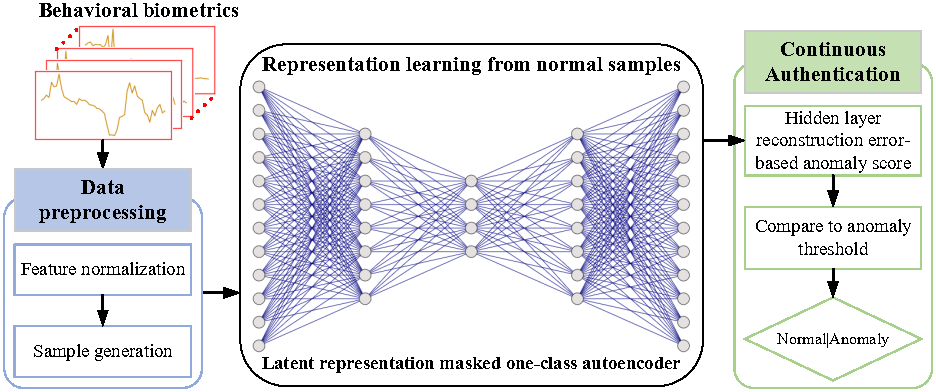
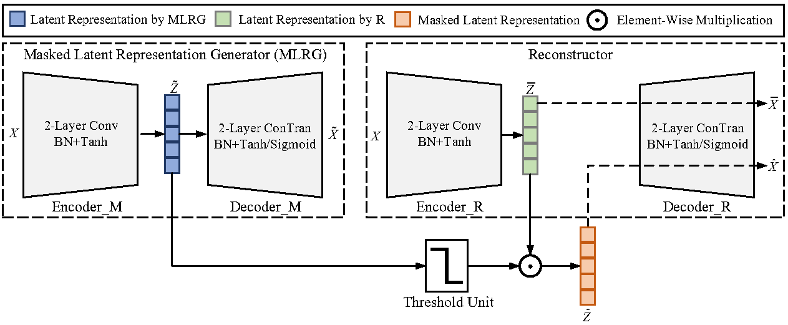
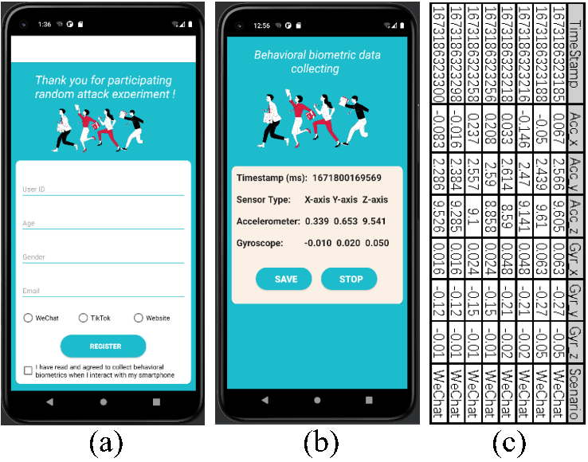
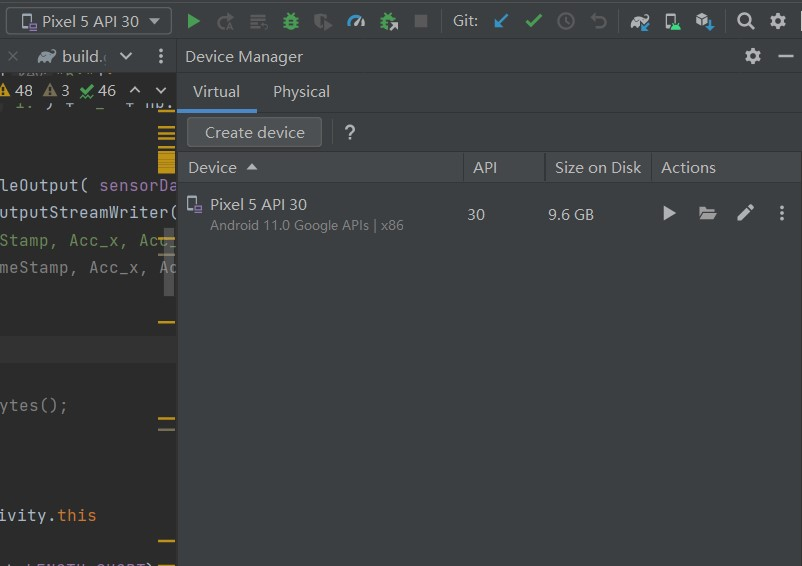

# Behavioral Biometrics-based Continuous Authentication Using A Lightweight Latent Representation Masked One-Class Autoencoder 

Behavioral biometrics-based continuous authentication has proven to be an excellent supplement to one-time authentication schemes that applies behavioral biometrics to authenticate smartphone users’ identities throughout the session. However, it still has two key issues that need to be addressed: 1) Due to behavioral biometrics from attackers are not available a priori, continuous authentication models should be trained only with normal samples in an unsupervised manner rather than treated as binary or multi-class classification tasks; 2) Differences in behavioral biometrics between attackers and legitimate users are fine-grained, it is challenging to extract rich semantic information to model users’ behavioral patterns. To fill this gap, we propose a lightweight latent representation masked one-class autoencoder, which is trained only with legitimate users’ behavioral biometrics. It consists of two parts: masked latent representation generator (MLRG) and Reconstructor. Firstly, we apply the MLRG to generate discriminative latent representation with low dimension and then as a mask to cover important parts of the latent representation generated from the Reconstructor. Secondly, we apply the Reconstructor to reconstruct input based on masked latent representation. 
## Architecture of Continuous Authentication System

Fig. 1. The architecture of the proposed continuous authentication system consists of three parts: data preprocessing module, representation learning from normal samples module and continuous authentication module.
## The Proposed Latent Representation Masked One-Class Autoencoder

Fig. 2. The architecture of the proposed latent representation masked one-class autoencoder. The masked latent representation generator (MLRG) is used to generate a mask, which can mask the important part of the latent representation of the input. The Reconstructor is used to reconstruct the input based on the masked latent representation. The standard autoencoder consists of an Encoder and a Decoder. To clearly distinguish the Encoder and Decoder in MLRG and Reconstructor, we use Encoder_M and Decoder_M to represent Encoder and Decoder in the MLRG, and the Encoder_R and Decoder_R to represent Encoder and Decoder in the Reconstructor.

To evaluate the ability of our continuous authentication system to resist various attacks in the real-world environment, we develop a behavioral biometric data collection App based on the Android system. As shown in Fig. 3a, participants who are selected as attackers use three application scenarios (WeChat, TikTok, and Website) to interact with legitimate user’s smartphones, and our developed App can collect the behavioral biometric data from the accelerometer and gyroscope (shown in Fig. 3b) when attackers interact with the legitimate users’ smartphones. Fig. 3c shows the example of stored behavioral biometric data (.csv) in the Android system. 

Fig. 3. The developed behavioral biometric data collection App (Android) for anti-attack analysis. a) user registration page; b) behavioral biometric data collection, display, and storage page; c) example of generated behavioral biometric data file (.csv) at /data/data/com.example.BehavioralBiometricsCollection/files/ in Android system.
## Deployment Environment
The integration development environment platform for the Behavioral Biometric Collection App is deployed on Ubuntu 22.04, with a system kernel version of 6.5.0-26-generic. It features 32 GB of RAM and a 4.5 TB mechanical hard drive, and is equipped with an Intel® Core™ i5-10400F CPU @ 2.90GHz processor. The integrated development environment platform is Android Studio, with the version being Android Studio Giraffe | 2022.3.1 Patch 2, VM: OpenJDK 64-Bit Server VM by JetBrains s.r.o. When debugging, the Android emulator version used is Pixel API 30 (Android API 34 Google APIs|x86_64). For real device debugging, the mobile device used is Nova5i Pro, with the operating system version being Harmony OS 3.0.0. The processor is Huawei Kirin 810, with 8.0 GB of RAM.
## Installation
1.You should install the integrated development environment platform “Android Studio”. You can download it from https://developer.android.com/studio?hl=zh-cn.
2. You can open the Behavioral Biometric Data Collection App project with the Android Studio.  And then, according to the instructions, add a virtual machine device (Android emulator) as shown in Fig. 4. We add the Android emulator version used is Pixel API 30 (Android API 34 Google APIs|x86_64). You can choose other versions of the Android emulator as needed.

Fig. 4 Create android device
1. And then you can run the App, and you will find the register page. Fill in the relevant information as required and click the Register button, and you will find the behavioral biometric data collection, display, and storage page. And then click the Start button, the collected behavioral biometric data will be stored at /data/data/com.example.BehavioralBiometricsCollection/files/ in Android system.
4.For real device debugging, the mobile device used is Nova5i Pro, with the operating system version being Harmony OS 3.0.0. If you want to run on the real android device, you need to enable Developer Mode on your Android device and connect it to your computer using a USB cable. Then, Android Studio will automatically detect your Android device and successfully install the Data Collection App on it.

